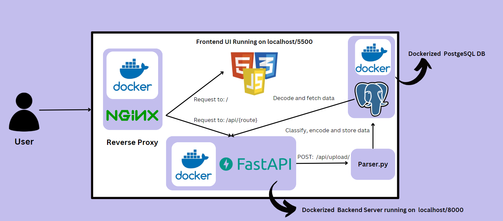
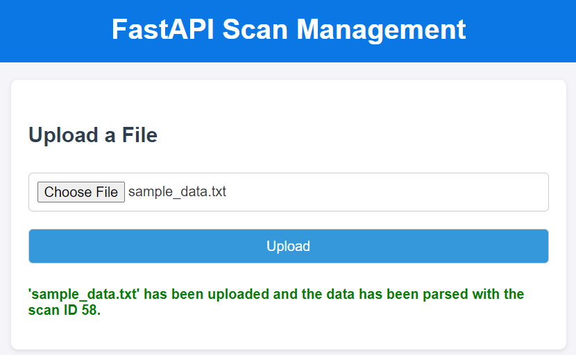
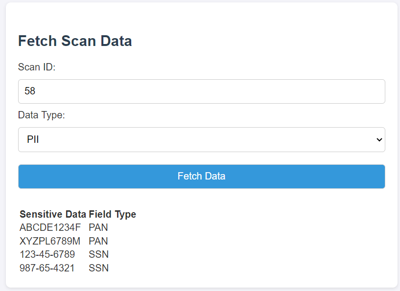
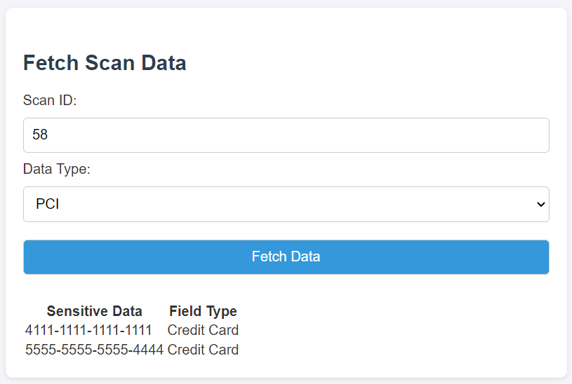
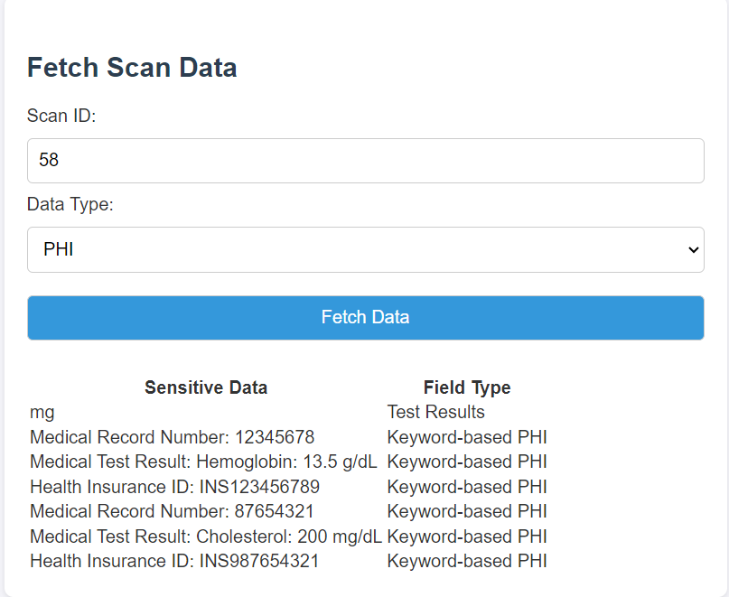
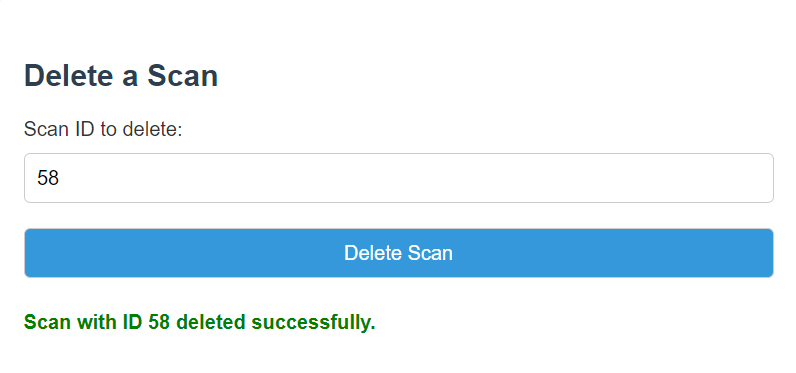
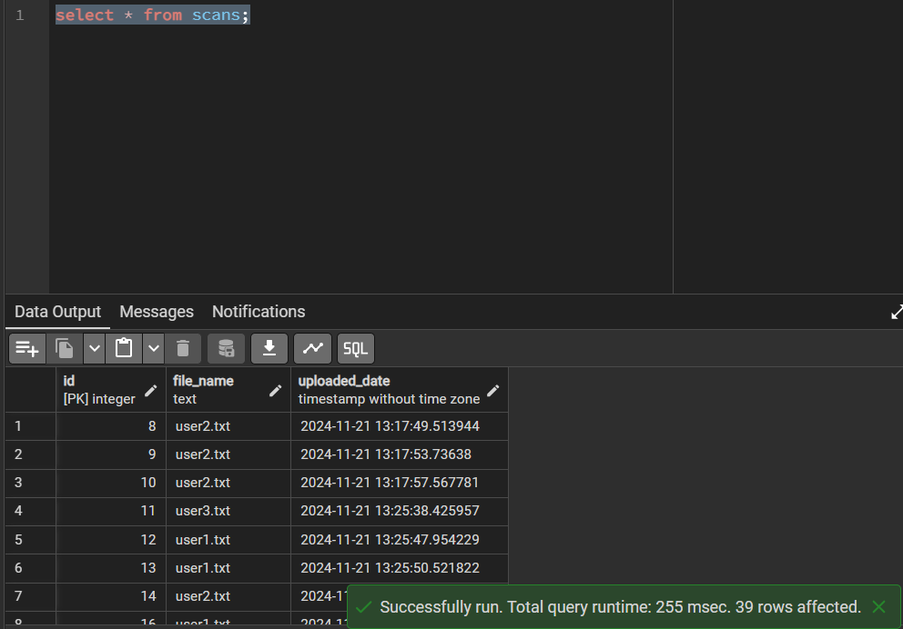
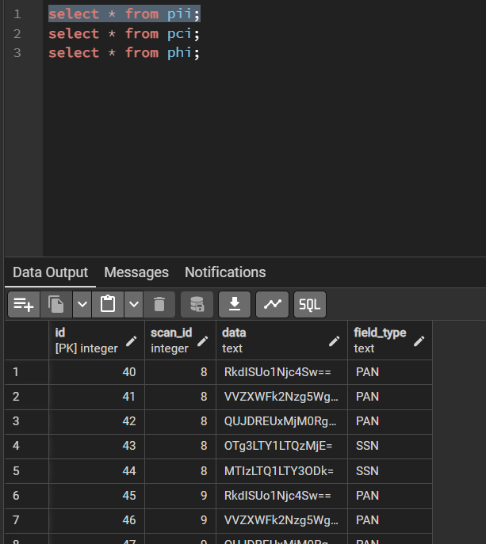
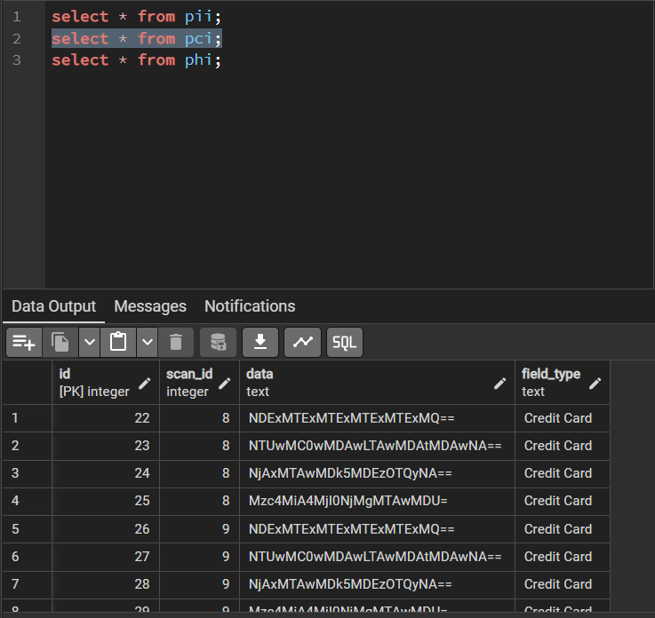
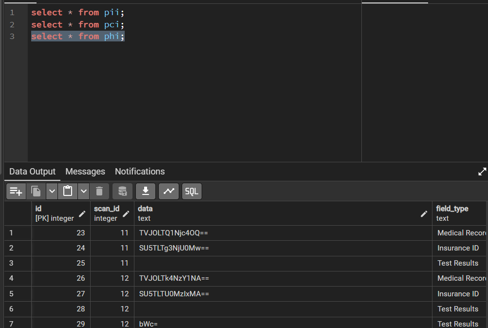

# **Dockerized Full-Stack Sensitive Data Scanner Tool**

---

## **Project Overview**

The **Sensitive Data Scanner Tool** is a comprehensive solution for detecting, classifying, and managing sensitive data within uploaded files. It identifies various types of sensitive information and categorizes them into compliance-friendly classifications:


### **Supported Data Types**
- **PAN Card Numbers**
- **US Social Security Numbers (SSN)**
- **Medical Record Numbers**
- **Medical Test Results**
- **Health Insurance Information**
- **Credit Card Numbers**

### **Data Classifications**
- **PII (Personally Identifiable Information):** E.g., PAN, SSN
- **PHI (Protected Health Information):** E.g., Medical records, test results
- **PCI (Payment Card Information):** E.g., Credit card numbers

This tool integrates seamlessly into workflows, ensuring organizations can enhance compliance with data protection regulations.

---
## **Database Architecture**

The **PostgreSQL** database schema is structured to store information about scanned files and their classifications across PII, PCI, and PHI.  

### **Tables**

1. **`scans`**: Stores metadata about uploaded files.
2. **`pii`**: Stores identified PII data for each file scan.
3. **`pci`**: Stores identified PCI data for each file scan.
4. **`phi`**: Stores identified PHI data for each file scan.

### **Table Definitions**

#### **`scans` Table**
| **Column Name**    | **Data Type**    | **Description**                                   |
|---------------------|------------------|---------------------------------------------------|
| `id`               | `SERIAL`         | Primary key, unique identifier for each file scan. |
| `file_name`        | `TEXT`           | Name of the uploaded file.                       |
| `uploaded_date`    | `TIMESTAMP`      | Timestamp when the file was uploaded (default: current time). |

#### **`pii` Table**
| **Column Name**    | **Data Type**    | **Description**                                   |
|---------------------|------------------|---------------------------------------------------|
| `id`               | `SERIAL`         | Primary key, unique identifier for each PII record. |
| `scan_id`          | `INTEGER`        | Foreign key referencing the `scans` table.       |
| `data`             | `TEXT`           | The extracted PII data.                          |
| `field_type`       | `TEXT`           | The type of PII field (e.g., PAN, SSN).          |

#### **`pci` Table**
| **Column Name**    | **Data Type**    | **Description**                                   |
|---------------------|------------------|---------------------------------------------------|
| `id`               | `SERIAL`         | Primary key, unique identifier for each PCI record. |
| `scan_id`          | `INTEGER`        | Foreign key referencing the `scans` table.       |
| `data`             | `TEXT`           | The extracted PCI data.                          |
| `field_type`       | `TEXT`           | The type of PCI field (e.g., credit card numbers).|

#### **`phi` Table**
| **Column Name**    | **Data Type**    | **Description**                                   |
|---------------------|------------------|---------------------------------------------------|
| `id`               | `SERIAL`         | Primary key, unique identifier for each PHI record. |
| `scan_id`          | `INTEGER`        | Foreign key referencing the `scans` table.       |
| `data`             | `TEXT`           | The extracted PHI data.                          |
| `field_type`       | `TEXT`           | The type of PHI field (e.g., medical record, test result). |

## **Key Features**

1. **Automatic Sensitive Data Classification**  
   - Identifies and categorizes sensitive data from uploaded files.  

2. **Detailed Insights**  
   - Provides context and classification for every detected field.  

3. **Secure Data Storage**  
   - Stores scanned results and metadata in a **PostgreSQL database** for tracking and auditing.  

4. **RESTful Backend APIs**  
   - Handles:
     - File uploads
     - Scanning and classification
     - Retrieval of scan results  

5. **User-Friendly Frontend**  
   - HTML-based interface for:
     - Uploading files
     - Viewing scan results  

6. **Dockerized Architecture**  
   - Includes:
     - **FastAPI** backend
     - **PostgreSQL** database
     - **Nginx** reverse proxy
      
7. **Modular, Linted Codebase**  
   - Backend code follows **modular design principles** and is consistently formatted using **autopep8** for readability and maintainability.

8. **Comprehensive Unit Testing**  
   - **Pytest**-based unit tests ensure complete coverage for all backend functions using **mock data**, promoting reliability and robustness.

9. **Sample Data:**
   - Sample data for testing and experimentation is available in the `app/assets` directory.
---

## **Project Components**

| **Component** | **Description**                          | **Port** |
|---------------|------------------------------------------|----------|
| Backend       | Built with **FastAPI** for API handling  | `8000`   |
| Frontend      | Static files served via **Nginx**        | `5500`   |
| Database      | Powered by **PostgreSQL** for persistence| N/A      |
| Nginx         | Routes requests between backend and frontend | `80`    |

---

## **Prerequisites**

Ensure the following tools are installed on your system:

- [Docker](https://www.docker.com/products/docker-desktop)  
- [Docker Compose](https://docs.docker.com/compose/)  

---

## **Setup Instructions**

### 1. Clone the Repository
```bash
git clone <repository-url>
cd <repository-folder>

```
### **Step 2: Configure Environment Variables**
Update the `docker-compose.yml` file with your database credentials and other environment variables:

```yaml
environment:
  - DB_HOST=db
  - DB_PORT=5432
  - DB_NAME=<your_db_name>
  - DB_USER=<your_db_user>
  - DB_PASSWORD=<your_db_password>
```
### **Step 3: Check the Nginx Configuration**
Ensure the `nginx/nginx.conf` file is set up correctly for routing:

```nginx
server {
    listen 80;

    location /api/ {
        proxy_pass http://backend:8000/;
    }

    location / {
        proxy_pass http://frontend:5500/;
    }
}
```
## **Running the Project Locally**

### **Step 1: Build and Start the Application**
Run the following command to build and start the application using Docker Compose:

```bash
docker-compose up --build
```
### **Step 4: Run the Testcases locally**
Unit Testing with Pytest
The backend includes unit tests for all functions, ensuring 100% coverage.
Tests use mock data to simulate different scenarios for sensitive data detection and classification.
Run the tests locally with the following command:

```bash
pytest tests/
```
### **Step 3: Access the Application**
- **Frontend:** [http://localhost:5500](http://localhost:5500)  
- **Backend API:** [http://localhost:8000](http://localhost:8000)  
- **API Documentation:** [http://localhost:8000/docs](http://localhost:8000/docs)

### **Step 4: Stop the Application**
Run the following command to stop the application using Docker Compose:

```bash
docker-compose down
```

## **Production-Ready Deployment**

This project can be prepared for production using **AWS services** like **EC2**, **ECR**, **ECS**, and **ALB** to ensure scalability, security, and high availability. Here's how these services fit into the production pipeline:

### **AWS Services Integration**
1. **EC2 (Elastic Compute Cloud):**
   - Hosts the backend, frontend, and Nginx reverse proxy.
   - Supports Auto Scaling Groups (ASG) for handling increased traffic dynamically.

2. **ECR (Elastic Container Registry):**
   - Stores Docker images for backend, frontend, and Nginx.
   - Simplifies image management and integration with ECS.

3. **ECS (Elastic Container Service):**
   - Runs containerized applications using either EC2.
   - Manages task definitions for each service (backend, frontend, and proxy).

4. **ALB (Application Load Balancer):**
   - Routes traffic between frontend and backend containers.
   - Handles SSL termination for secure communication.
   - Supports routing rules (e.g., `/` to frontend, `/api/` to backend based on the route called).

## **User Interface Snippets**






## **Database Architecture Snippets**




